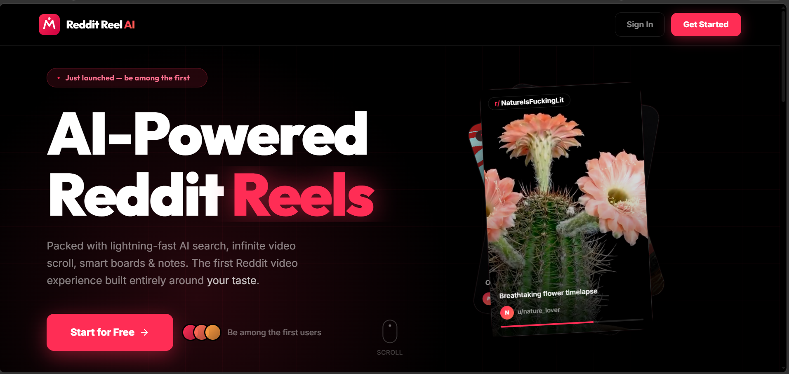
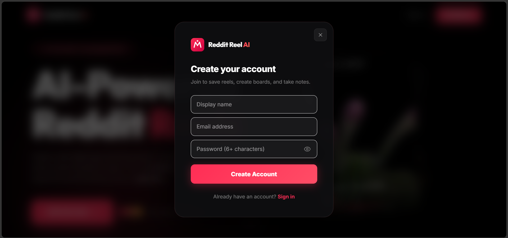
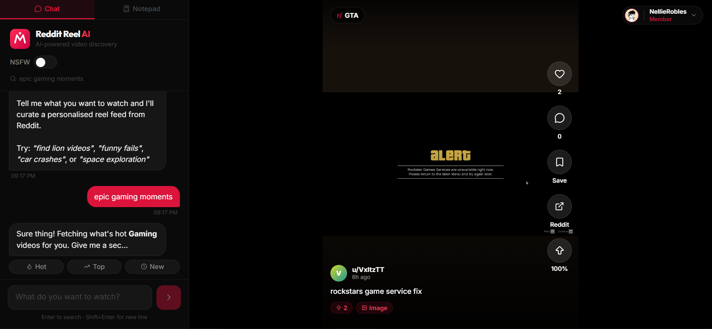
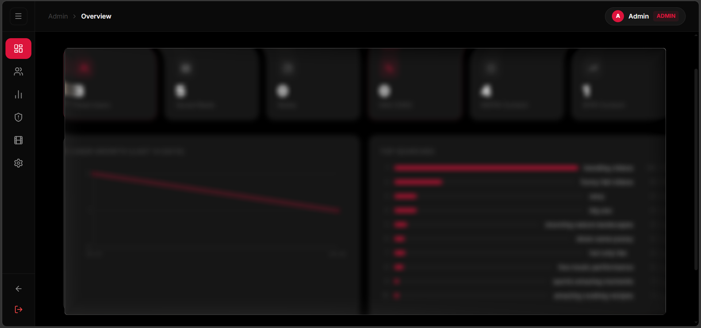

<div align="center">

# 🎬 Reddit Reel AI

### AI-Powered TikTok-Style Video Feed from Reddit

Transform Reddit into an infinite scroll video experience with intelligent AI search

[](https://nextjs.org)
[](https://typescriptlang.org)
[](https://prisma.io)
[](https://react.dev)
[](LICENSE)

[Features](#-features) • [Screenshots](#-screenshots) • [Quick Start](#-quick-start) • [Tech Stack](#-tech-stack)

</div>

---

## 📸 Screenshots

<div align="center">

### 🏠 Landing Page


### 🔐 Authentication


### 📱 Dashboard


### 👨‍💼 Admin Panel


</div>

---

## ✨ Features

<table>
<tr>
<td width="50%">

### 🤖 **Smart AI Search**
Natural language queries powered by Ollama LLM with intelligent fallback

### 📱 **Vertical Feed**
Full-screen TikTok-style scroll experience with smooth animations

### 🎬 **Full Audio Support**
HLS streaming for complete Reddit video playback

### 💾 **Custom Boards**
Save and organize your favorite reels into collections

</td>
<td width="50%">

### 🔐 **Secure Auth**
JWT sessions with bcrypt encryption and role-based access

### 🔞 **NSFW Mode**
Age-gated adult content with 2000+ subreddit coverage

### 👨‍💼 **Admin Dashboard**
User management, analytics, and content moderation

### ⚡ **Smart Preloading**
Next reel loads while you watch for seamless experience

</td>
</tr>
</table>

---

## 🚀 Quick Start

### Prerequisites

```bash
Node.js 18+  |  npm/yarn  |  Ollama (optional)
```

### Installation

```bash
# Clone the repository
git clone https://github.com/tarunkumar-sys/next_llm.git
cd next_llm

# Install dependencies
npm install

# Setup environment
cp .env.example .env.local
# Edit .env.local with your configuration

# Initialize database
npx prisma generate
npx prisma db push

# Start development server
npm run dev
```

Visit **http://localhost:3000** 🎉

---

## ⚙️ Configuration

Create `.env.local` in the root directory:

```env
# Authentication (Required)
AUTH_SECRET=your-secret-key-here    # Generate: npx auth secret
DATABASE_URL=file:./prisma/dev.db

# Reddit API (Optional - improves rate limits)
REDDIT_CLIENT_ID=your-client-id
REDDIT_CLIENT_SECRET=your-client-secret

# AI Features (Optional)
OLLAMA_URL=http://localhost:11434
OLLAMA_MODEL=llama3.2
```

<details>
<summary><b>🔑 Getting Reddit API Credentials</b></summary>

1. Go to [reddit.com/prefs/apps](https://www.reddit.com/prefs/apps)
2. Click "Create App" or "Create Another App"
3. Select "web app"
4. Set redirect URI to `http://localhost:3000`
5. Copy your client ID and secret

</details>

---

## 🛠️ Tech Stack

<div align="center">

### Frontend


### Backend


### Authentication & Security


### AI & APIs


### Development Tools


</div>

---

## 📁 Project Structure

```
reddit-reel-ai/
├── app/
│   ├── api/              # API routes (Reddit, AI interpreter)
│   │   ├── reddit/       # Reddit content fetcher
│   │   └── interpret/    # AI query interpreter
│   ├── actions/          # Server actions (auth, database)
│   │   ├── auth.ts       # Authentication actions
│   │   ├── db.ts         # Database operations
│   │   └── admin.ts      # Admin operations
│   ├── admin/            # Admin dashboard
│   ├── dashboard/        # User dashboard
│   └── _landing.tsx      # Landing page
├── components/           # React components
│   ├── ReelFeed.tsx      # Video player
│   ├── ChatPanel.tsx     # AI search interface
│   ├── Notepad.tsx       # Boards manager
│   ├── LoginModal.tsx    # Authentication modal
│   └── ...
├── lib/                  # Utilities & helpers
│   ├── feedEngine.ts     # Feed algorithm
│   ├── security.ts       # Security utilities
│   └── ...
├── prisma/               # Database schema & migrations
│   ├── schema.prisma     # Database schema
│   └── migrations/       # Migration history
└── public/               # Static assets
    └── demo_img/         # Demo screenshots
```

---

## 🎯 Key Features Explained

### 🤖 AI-Powered Search
Query in natural language: *"Show me funny cat videos"* → AI interprets and fetches relevant content from 2000+ subreddits

**Two-tier system:**
1. **Ollama LLM** - Advanced natural language understanding
2. **Rule-based fallback** - Always available, regex-based matching

### 📊 Intelligent Feed Algorithm
- **Weighted round-robin** distribution for variety
- **Personalization** based on user activity
- **No consecutive posts** from same subreddit
- **Smart preloading** for seamless experience

### 🗂️ Comprehensive Content Coverage

**Normal Mode:**
- 50+ categories
- 2000+ subreddits
- Categories: Animals, Gaming, Sports, Tech, Music, Movies, Art, Science, and more

**NSFW Mode:**
- 35+ categories
- 500+ subreddits
- Age-gated with proper authentication

---

## 🛡️ Security Features

<table>
<tr>
<td>

- 🔒 **JWT Authentication** with HttpOnly cookies
- 🔐 **bcrypt Password Hashing** (10 rounds)
- 🛡️ **Security Headers** (CSP, X-Frame-Options, etc.)
- 👮 **Role-Based Access Control** (User/Admin)

</td>
<td>

- 🚫 **API Route Protection** with auth guards
- 🔍 **Input Sanitization** and validation
- 🔑 **Session Management** with secure tokens
- 📝 **Audit Logging** for admin actions

</td>
</tr>
</table>

---

## 📜 Available Scripts

```bash
npm run dev          # Start development server (Turbopack)
npm run build        # Build for production
npm start            # Start production server
npm run lint         # Run ESLint
npx prisma studio    # Open database GUI
npx prisma db push   # Push schema changes to database
npx prisma generate  # Generate Prisma Client
```

---

## 🚀 Deployment

<details>
<summary><b>Deploy to Vercel</b></summary>

1. Push your code to GitHub
2. Import project in [Vercel](https://vercel.com)
3. Add environment variables
4. Deploy!

See [DEPLOYMENT.md](DEPLOYMENT.md) for detailed instructions.

</details>

<details>
<summary><b>Docker Deployment</b></summary>

```bash
# Build image
docker build -t reddit-reel-ai .

# Run container
docker run -p 3000:3000 reddit-reel-ai
```

</details>

---

## 🤝 Contributing

Contributions are welcome! Please read [CONTRIBUTING.md](CONTRIBUTING.md) for guidelines.

1. Fork the repository
2. Create your feature branch (`git checkout -b feature/amazing-feature`)
3. Commit your changes (`git commit -m 'Add amazing feature'`)
4. Push to the branch (`git push origin feature/amazing-feature`)
5. Open a Pull Request

---

## 📝 License

This project is licensed under the MIT License - see the [LICENSE](LICENSE) file for details.

---

## 🙏 Acknowledgments

- **Reddit API** for content delivery
- **Ollama** for local AI capabilities
- **Next.js Team** for the amazing framework
- **Vercel** for hosting platform
- All contributors and supporters

---

## 📞 Support

- 📧 Email: [your-email@example.com](mailto:your-email@example.com)
- 🐛 Issues: [GitHub Issues](https://github.com/tarunkumar-sys/next_llm/issues)
- 💬 Discussions: [GitHub Discussions](https://github.com/tarunkumar-sys/next_llm/discussions)

---

<div align="center">

**Made with ❤️ by [Tarun Kumar](https://github.com/tarunkumar-sys)**

⭐ Star this repo if you find it useful!

[Report Bug](https://github.com/tarunkumar-sys/next_llm/issues) • [Request Feature](https://github.com/tarunkumar-sys/next_llm/issues) • [Documentation](https://github.com/tarunkumar-sys/next_llm/wiki)

</div>
